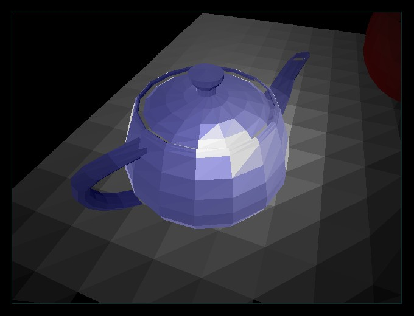



## Flat Shading 3D, Pure VB

### Description

A 3D demonstration for Flat Shading in pure VB

code (see sceen shot)
 
### More Info
 

             |
---                |---
**Submitted On**   |2005-03-30 07:09:20
**By**             |[KACI   Lounes](https://github.com/Planet-Source-Code/PSCIndex/blob/master/ByAuthor/kaci-lounes.md)
**Level**          |Advanced
**User Rating**    |5.0 (30 globes from 6 users)
**Compatibility**  |VB 4\.0 \(32\-bit\), VB 5\.0, VB 6\.0
**Category**       |[Graphics](https://github.com/Planet-Source-Code/PSCIndex/blob/master/ByCategory/graphics__1-46.md)
**World**          |[Visual Basic](https://github.com/Planet-Source-Code/PSCIndex/blob/master/ByWorld/visual-basic.md)
**Archive File**   |[Flat\_Shadi1869773302005\.zip](https://github.com/Planet-Source-Code/kaci-lounes-flat-shading-3d-pure-vb__1-59730/archive/master.zip)

